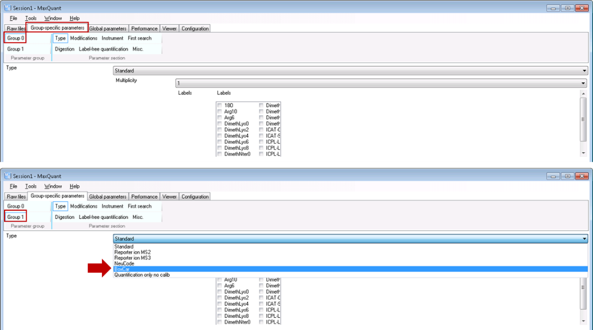

BoxCar
======

**BoxCar acquisition method enables single-shot proteomics at a depth of 10,000 proteins in 100 minutes**
*Florian Meier, Philipp E. Geyer, Sebastian Virreira Winter, Juergen Cox & Matthias Mann*
`doi: 10.1038/s41592-018-0003-5 <https://www.nature.com/articles/s41592-018-0003-5>`_

The BoxCar acquisition method for high resolution mass spectrometry-based proteomic builds on the combined acquisition of narrow m/z windows to enhance the mean ion filling time as compared to stand-ard full scans.

Acquisition
-----------
All MS parameters are defined and saved in MaxQuant.Live scan protocols.
The pop-up window allows you to set all instrument parameters required for BoxCar runs. The acquisition cycle comprises one Full Scan, N BoxCar scans and Z data-dependent MS2 scans. Precursors for MS2 are se-lected from the Full Scan. Note that the mass resolution in the full scan must equal the mass resolution setting in the BoxCar scans for MaxQuant data analysis. For BoxCar scans, each box will be assigned a maximum ion injection time of 1/N th of the total, for example 10 ms for each of 10 boxes per scan with a total max. ion injection time of 100 ms. The same applies to the AGC target value. The BoxCar window placement will be automatically scaled to the expected m/z distribution of tryptic peptides.

.. warning:: Choosing a too high AGC target for BoxCar scans may cause space-charge effects by overloading the Orbitrap. 

.. warning:: Currently, only profile scans are recognized by MaxQuant.  

+-----------------------------+----------------------------------------------------------------------------------------------------+
| Method parameter            | Description                                                                                        |
+=============================+====================================================================================================+
| **General**                 |                                                                                                    |
+-----------------------------+----------------------------------------------------------------------------------------------------+
| BoxCar Scans                | Number of BoxCar scans per acquisition cycle                                                       |
+-----------------------------+----------------------------------------------------------------------------------------------------+
| BoxCar Boxes                | Number of boxes per BoxCar scan                                                                    |
+-----------------------------+----------------------------------------------------------------------------------------------------+
| BoxCar overlap              | M/z overlap of neighboring boxes (Th)                                                              |
+-----------------------------+----------------------------------------------------------------------------------------------------+
| ScanDataAsProfile           | Profile (true) or centroid (false) spectra                                                         |
+-----------------------------+----------------------------------------------------------------------------------------------------+
| Positive mode               | Electrospray polarity                                                                              |
+-----------------------------+----------------------------------------------------------------------------------------------------+
| **Full Scan settings**      |                                                                                                    |
+-----------------------------+----------------------------------------------------------------------------------------------------+
| MaxIT                       | Maximum ion injection time (ms)                                                                    |
+-----------------------------+----------------------------------------------------------------------------------------------------+
| Resolution                  | MS resolving power at m/z 200                                                                      |
+-----------------------------+----------------------------------------------------------------------------------------------------+
| AGCtarget                   | AGC target value (charges)                                                                         |
+-----------------------------+----------------------------------------------------------------------------------------------------+
| MzRange                     | Scan range (m/z)                                                                                   |
+-----------------------------+----------------------------------------------------------------------------------------------------+
| **BoxCar scan settings**    |                                                                                                    |
+-----------------------------+----------------------------------------------------------------------------------------------------+
| MaxITBoxCar                 | Maximum total ion injection time (ms) for BoxCar scans. Each box is assigned 1/N th of this value. |
+-----------------------------+----------------------------------------------------------------------------------------------------+
| ResolutionBoxCar            | MS resolving power at m/z 200                                                                      |
+-----------------------------+----------------------------------------------------------------------------------------------------+
| AgcTargetBoxCar             | Total AGC target value for each BoxCar scan (charges). Each box is assigned 1/N th of this value.  |
+-----------------------------+----------------------------------------------------------------------------------------------------+
| MzRangeBoxCar               | Scan range (m/z)                                                                                   |
+-----------------------------+----------------------------------------------------------------------------------------------------+
| **Fragmentation**           |                                                                                                    |
+-----------------------------+----------------------------------------------------------------------------------------------------+
| NumOfPrecursors             | Number of precursor ions per acquisition cycle                                                     |
+-----------------------------+----------------------------------------------------------------------------------------------------+
| Normalized collision energy | Normalized collision energy (NCE)                                                                  |
+-----------------------------+----------------------------------------------------------------------------------------------------+
| DynamicExclusion            | Dynamic exclusion time of precursors after first spectrum (s)                                      |
+-----------------------------+----------------------------------------------------------------------------------------------------+
| Exclusion mass tolerance    | Mass tolerance for dynamic exclusion (ppm)                                                         |
+-----------------------------+----------------------------------------------------------------------------------------------------+
| Exclusion threshold         | Intensity threshold for dynamic exclusion                                                          |
+-----------------------------+----------------------------------------------------------------------------------------------------+
| Isolation window            | Width of the precursor isolation window (Th)                                                       |
+-----------------------------+----------------------------------------------------------------------------------------------------+
| MinCharge                   | Minimum charge state of the precursor                                                              |
+-----------------------------+----------------------------------------------------------------------------------------------------+
| MaxCharge                   | Maximum charge state of the precursor                                                              |
+-----------------------------+----------------------------------------------------------------------------------------------------+
| Intensity threshold         | Precursor intensity threshold (cps)                                                                |
+-----------------------------+----------------------------------------------------------------------------------------------------+
| MinMass                     | Minimum mass threshold for precursor ions (Da)                                                     |
+-----------------------------+----------------------------------------------------------------------------------------------------+
| **Ms2 scan settings**       |                                                                                                    |
+-----------------------------+----------------------------------------------------------------------------------------------------+
| MaxIT                       | Maximum ion injection time (ms)                                                                    |
+-----------------------------+----------------------------------------------------------------------------------------------------+
| Resolution                  | MS resolving power at m/z 200                                                                      |
+-----------------------------+----------------------------------------------------------------------------------------------------+
| AgcTarget                   | AGC target value (charges)                                                                         |
+-----------------------------+----------------------------------------------------------------------------------------------------+

Analysis
--------
MaxQuant is a software package for quantitative high resolution mass-spectrometry based proteomics (Cox and Mann, Nature Biotechnology 2008 (26), 1367-1372, doi: 10.1038/nbt.1511) and can be downloaded from http://www.maxquant.org. We have recently published a detailed and up-to-date description of the MaxQuant computational platform (Tyanova et al., Nature Protocols 2016 (11), 2301–2319, doi: 10.1038/nprot.2016.136). Please refer to this publication for information about different processing workflows and a detailed description of the parameters. Here, we provide a step-by-step protocol to analyze raw files acquired with the BoxCar method. Default parameters were used unless indicated. 

1. Open a new MaxQuant (v1.6.1.0 or later) session and load or ‘drag and drop’ Thermo .raw files into the MaxQuant window. 
2. Set experiment name for each raw file (or load experimental design template if applicable). 
3. Set parameter groups for each raw file. BoxCar and shotgun experiments need to be in separate parameter groups. Fractions (if applicable) should not be specified when matching from a fractionated peptide library into single runs is intended.
4. Set group specific parameters. Select “Type / Standard” for each experiment group containing regular shotgun experiments and “Type / BoxCar” for each group containing BoxCar experiments, respectively. 

    
5. Set global parameters:

 * Add the corresponding FASTA file(s) for the species under investigation.  
 * To transfer MS/MS identifications between runs, check “Match between runs” in the “Adv. identification” tab. It is recommended to adjust matching time tolerances according to your chromatography setup. 

6. Start the automated processing workflow. MaxQuant output files will be written in the ‘combined\txt\’ folder when finished.

