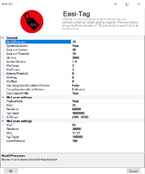

Easitag and TopN
=================

**EASI-tag enables accurate multiplexed and interference-free MS2-based proteome quantification**
*Sebastian Virreira Winter, Florian Meier, Christoph Wichmann, Juergen Cox, Matthias Mann & Felix Meissner*
`doi: 10.1101/225649 <https://www.nature.com/articles/s41592-018-0037-8>`_

    
The EasiTag strategy is based on the standard topN strategy but has some modifications and extensions. 
In EasiTag, the precursor selection is more stringent and only select monoisotopic peaks for fragmentation. 
Furthermore, the isolation windows are shifted by a global offset and their size chosen to be charge state dependent. 

+-----------------------------------+---------------------------------------------------------------------+
| Method parameter                  | Description                                                         |
+===================================+=====================================================================+
| **General**                       |                                                                     |
+-----------------------------------+---------------------------------------------------------------------+
| NumOfPrecursors                   | Number of precursor ions per acquisition cycle                      |
+-----------------------------------+---------------------------------------------------------------------+
| DynamicExclusion                  | Switch for dynamic exclusion                                        |
+-----------------------------------+---------------------------------------------------------------------+
| ExclusionDuration                 | Dynamic exclusion time of precursors after first spectrum (s)       |
+-----------------------------------+---------------------------------------------------------------------+
| ExclusionThreshold                | Mass tolerance for dynamic exclusion (ppm)                          |
+-----------------------------------+---------------------------------------------------------------------+
| LifeTime                          | Max time a MS2 scan stays in the queue (ms)                         |
+-----------------------------------+---------------------------------------------------------------------+
| Isolation window                  | Width of the precursor isolation window (Th)                        |
+-----------------------------------+---------------------------------------------------------------------+
| MinCharge                         | Minimum charge state of the precursor                               |
+-----------------------------------+---------------------------------------------------------------------+
| MaxCharge                         | Maximum charge state of the precursor                               |
+-----------------------------------+---------------------------------------------------------------------+
| Intensity threshold               | Precursor intensity threshold (cps)                                 |
+-----------------------------------+---------------------------------------------------------------------+
| MinMass                           | Minimum mass threshold for precursor ions (Da)                      |
+-----------------------------------+---------------------------------------------------------------------+
| MzOffset                          | Offset that is added to the peak mz-value (Th)                      |
+-----------------------------------+---------------------------------------------------------------------+
| UseChargeSpecificIsolationWindows | Switch to enable charge specific isolation windows                  |
+-----------------------------------+---------------------------------------------------------------------+
| IsolationWindowList               | Define isolation windows widths for every allowed charge state      |
+-----------------------------------+---------------------------------------------------------------------+
| ScanDataAsProfile                 | Profile (true) or centroid (false) spectra                          |
+-----------------------------------+---------------------------------------------------------------------+
| **MS1 Scan settings**             |                                                                     |
+-----------------------------------+---------------------------------------------------------------------+
| PositiveMode                      | Ion polarity                                                        |
+-----------------------------------+---------------------------------------------------------------------+
| MaxIT                             | Maximum ion injection time (ms)                                     |
+-----------------------------------+---------------------------------------------------------------------+
| Resolution                        | MS resolving power at m/z 200                                       |
+-----------------------------------+---------------------------------------------------------------------+
| AGCtarget                         | AGC target value (charges)                                          |
+-----------------------------------+---------------------------------------------------------------------+
| MzRange                           | Scan range (m/z)                                                    |
+-----------------------------------+---------------------------------------------------------------------+
| **Ms2 scan settings**             |                                                                     |
+-----------------------------------+---------------------------------------------------------------------+
| MaxIT                             | Maximum ion injection time (ms)                                     |
+-----------------------------------+---------------------------------------------------------------------+
| Resolution                        | MS resolving power at m/z 200                                       |
+-----------------------------------+---------------------------------------------------------------------+
| NCE                               | Normalized collision energies (whitespace separated - only EasiTag) |
+-----------------------------------+---------------------------------------------------------------------+
| AgcTarget                         | AGC target value (charges)                                          |
+-----------------------------------+---------------------------------------------------------------------+
| LowerMzBound                      | Lower Mz boundary for Ms2 spectra                                   |
+-----------------------------------+---------------------------------------------------------------------+
