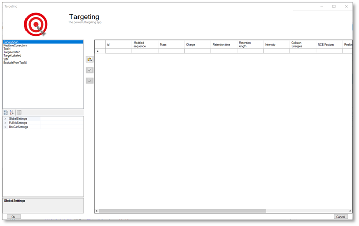

Targeting
=========

    
**MaxQuant.Live enables global targeting of more than 25,000 peptides**
*Christoph Wichmann, Florian Meier, Sebastian Virreira Winter, Andreas-David Brunner, Juergen Cox, Mat-thias Mann*
`doi: 1101/443838 <https://www.biorxiv.org/content/early/2018/10/15/443838>`_

The Targeting app allows the realization of various targeting strategies within on user interface.
First, the list of targeting peptides has to be populated and afterward the targeting strategy has 
to be defined and the parameters have to be set. 

Steps to setup a targeting run
-----------------

1. Populate the peptide list 
2. Set up targeting action
3. Set global parameters

Peptide list
------------
The targeting should comprise a set of peptides of interest and a set of high abundant peptides used for the 
real-time corrections of mass-to-charge values, expected retention times and peptide intensities. 
In order to get a reliable correction around 100 correction peptides per minute of the gradient is recommended.
If the set of targeting peptides is large enough, it is sufficient to only use them as correction peptides.

+--------------------+-------------------------------------------------------------------------------+-----------------------------------------------+
| Method parameter   | Description                                                                   |                                               |
+====================+===============================================================================+===============================================+
| Id                 | Identification number used in log messages                                    | optional                                      |
+--------------------+-------------------------------------------------------------------------------+-----------------------------------------------+
| Modified sequence  | String containing the modified sequence                                       | optional; Needed if isotopic labeling is used |
+--------------------+-------------------------------------------------------------------------------+-----------------------------------------------+
| Mass               | Ion mass                                                                      | mandatory                                     |
+--------------------+-------------------------------------------------------------------------------+-----------------------------------------------+
| Charge             | Ion charge state                                                              | mandatory                                     |
+--------------------+-------------------------------------------------------------------------------+-----------------------------------------------+
| Retention time     | Expected retention time (min)                                                 | mandatory                                     |
+--------------------+-------------------------------------------------------------------------------+-----------------------------------------------+
| Retention length   | Expected elution time (min)                                                   | mandatory but can be set to 0.0               |
+--------------------+-------------------------------------------------------------------------------+-----------------------------------------------+
| Intensity          | Expected intensity                                                            | mandatory but can be set to 1.0               |
+--------------------+-------------------------------------------------------------------------------+-----------------------------------------------+
| Collision Energies | Collision energies for fragmentation (white space separated: 11 21            | optional; if empty the global NCE is used     |
+--------------------+-------------------------------------------------------------------------------+-----------------------------------------------+
| NCE                | List of NCE scaling factor for fragmentation (white space separated: 1.2 2.3) | optional;                                     |
+--------------------+-------------------------------------------------------------------------------+-----------------------------------------------+

The required information of every peptide is the mass, the expected retention time, the retention length and its charge state. Additionally the modified sequence should be provided to be able to find the peptide later in the MaxQuant.Live log file. The expected intensity completes the set of peptides properties. Note here, that the retention length is currently not taken into account and can therefore also be set to a fixed number like 1. If you don’t have intensity information of the peptides it is also possible to set the intensities to one and choose the intensity threshold of the peptide recognition algorithm to a small value. 
The other columns contain checkboxes to enable actions called when the peptide is detected.
The peptide table can either be populated manually or filled automatically by pasting a table from the clipboard. In the latter case, a tabular calculation program like Microsoft Excel can be used to set up the peptide list. Select the rows of peptides in Excel, copy to the clipboard and click on the paste icon in MaxQuant.Live to paste into the peptide list. Make sure that the header row is also copied and that it contains the same labels as the MaxQuant.Live peptide list. Only then MaxQuant.Live can map the columns correctly. 

Setup of targeting actions
--------------------------

There are three ways to select targeting actions for peptides in the list
1. Click on the checkbox for every peptide manually
2. Select one or more peptides in the list, then select an action from the list of actions in the left panel and click on the check mark symbol in the middle. 
3. Add a column with the name of the action to your peptide list in Excel and will it with the Boolean values ``TRUE`` or ``FALSE``. When pasting the peptide in MaxQuant.Live, the software will set the checkboxes automatically. 

RealtimeCorrection 
""""""""""""""""""
The adaptive real-time correction adjusts the expected retention times based on the deviations of the peptide observed before. We refer to our article preprint in bioRxiv for more information about the real-time correction algorithm. We recommend to select around 100 peptides per minute ensure that the algorithm has enough statistic to take well-founded decisions. These peptide should be have a high intensity. 

+--------------------------+--------------------------------------------------------------+---------------+
| Parameter                | Description                                                  | Default value |
+==========================+==============================================================+===============+
| RetentionTimeWindow      | Retention time window size [min]                             | 20            |
+--------------------------+--------------------------------------------------------------+---------------+
| MzWindowBig              | Max mz window size [ppm]                                     | 20            |
+--------------------------+--------------------------------------------------------------+---------------+
| MzWindowSmall            | Min mz window size [ppm]                                     | 9             |
+--------------------------+--------------------------------------------------------------+---------------+
| SigmaScaleFactorRt       | Scaling factor for retention time window adjustment          | 3             |
+--------------------------+--------------------------------------------------------------+---------------+
| PeptideHistoryLength     | Time span considered to calculate the corrections [min]      | 2             |
+--------------------------+--------------------------------------------------------------+---------------+
| MinHistoryPeptides       | Minimum number of peptides used to calculate the corrections | 50            |
+--------------------------+--------------------------------------------------------------+---------------+
| IntensityThreshold       |                                                              | 1.00E-05      |
+--------------------------+--------------------------------------------------------------+---------------+
| PepdideDetectionIsoPeaks | Number of isotopic peaks that need to be found               | 2             |
+--------------------------+--------------------------------------------------------------+---------------+
| IsotopeTolerance         | Isotope mass tolerance [ppm]                                 | 9             |
+--------------------------+--------------------------------------------------------------+---------------+

TargetedMs2
"""""""""""

+-----------------+-----------------------------------------------------------------------------+---------------+
| Parameter       | Description                                                                 | Default value |
+=================+=============================================================================+===============+
| BatMode         | Fragment ion in every cycle within the retention time, even if not detected | FALSE         |
+-----------------+-----------------------------------------------------------------------------+---------------+
| Prioritize      | Prioritize MS2 scan, if the peptide was not fragmented before               | TRUE          |
+-----------------+-----------------------------------------------------------------------------+---------------+
| MaxNumOfScans   | Upper limit for the number of fragmentations per peptide. 0=no limit        | 0             |
+-----------------+-----------------------------------------------------------------------------+---------------+
| WindowSize      | Size of the isolation window [th]                                           | 1.4           |
+-----------------+-----------------------------------------------------------------------------+---------------+
| CollisionEnergy | Collision energy for fragmentation                                          | 27            |
+-----------------+-----------------------------------------------------------------------------+---------------+
| LifeTime        | Max time span before a scheduled MS2 scan get deleted [ms]                  | 2000          |
+-----------------+-----------------------------------------------------------------------------+---------------+
| MaxIT           | Maximum ion injection time (ms)                                             | 28            |
+-----------------+-----------------------------------------------------------------------------+---------------+
| Resolution      | MS resolving power at m/z 200                                               | 15000         |
+-----------------+-----------------------------------------------------------------------------+---------------+
| AgcTarget       | AGC target value (charges)                                                  | 100000        |
+-----------------+-----------------------------------------------------------------------------+---------------+
| PositiveMode    | Ion polarity                                                                | TRUE          |
+-----------------+-----------------------------------------------------------------------------+---------------+

TargetLabeled
"""""""""""""
This action adds the SILAC label masses to the peptides masses in the list. The “Modified is used to calculate the number Arg and Lys amino acids. The masses of SILAC labels can be freely defined here.

SIM (Selected Ion Monitoring)
""""

+-------------------+----------------------------------------------------------------------------------------------+---------------+
| Parameter         | Description                                                                                  | Default value |
+===================+==============================================================================================+===============+
| WindowOffset      | Shift the isolation window centers by this offset [th]                                       | 0             |
+-------------------+----------------------------------------------------------------------------------------------+---------------+
| Isotopic label    | Masses of SILAC labels                                                                       |               |
+-------------------+----------------------------------------------------------------------------------------------+---------------+
| MaxIT             | Maximum ion injection time (ms) [not used]                                                   | 50            |
+-------------------+----------------------------------------------------------------------------------------------+---------------+
| MaxItLight /Heavy | Maximum ion injection time for light/heavy channel (ms)                                      | 100           |
+-------------------+----------------------------------------------------------------------------------------------+---------------+
| InjectTargetLight | AGC target value for light/heavy peptide (charges)                                           | 50000         |
+-------------------+----------------------------------------------------------------------------------------------+---------------+
| BatMode           | Fragment ion in every cycle within the retention time tolerance window, even if not detected | FALSE         |
+-------------------+----------------------------------------------------------------------------------------------+---------------+
| Prioritize        | Prioritize MS2 scan, if the peptide was not fragmented before                                | TRUE          |
+-------------------+----------------------------------------------------------------------------------------------+---------------+
| MaxNumOfScans     | Upper limit for the number of fragmentations per peptide. 0=no limit                         | 0             |
+-------------------+----------------------------------------------------------------------------------------------+---------------+
| WindowSize        | Size of the isolation windows [th]                                                           | 1.4           |
+-------------------+----------------------------------------------------------------------------------------------+---------------+
| CollisionEnergy   | Collision energy for fragmentation                                                           | 0             |
+-------------------+----------------------------------------------------------------------------------------------+---------------+
| LifeTime          | Max time span before a scheduled MS2 scan get deleted [ms]                                   | 1000          |
+-------------------+----------------------------------------------------------------------------------------------+---------------+
|                   |                                                                                              |               |
+-------------------+----------------------------------------------------------------------------------------------+---------------+
| Resolution        | MS resolving power at m/z 200                                                                | 30000         |
+-------------------+----------------------------------------------------------------------------------------------+---------------+
| AgcTarget         | AGC target value (charges)                                                                   | 100000        |
+-------------------+----------------------------------------------------------------------------------------------+---------------+
| PositiveMode      | Ion polarity                                                                                 | TRUE          |
+-------------------+----------------------------------------------------------------------------------------------+---------------+

ExcludeFromTopN
"""""""""""""""

+-----------------------+-----------------------------------------------------------------------------------------+---------------+
| Parameter             | Description                                                                             | Default value |
+=======================+=========================================================================================+===============+
| BatMode               | Exclude ion from TopN within the retention time tolerance window , even if not detected | FALSE         |
+-----------------------+-----------------------------------------------------------------------------------------+---------------+
| StaticExclusionTime   | Time span the peptide is excluded from TopN (30)                                        | 30            |
+-----------------------+-----------------------------------------------------------------------------------------+---------------+
| AdaptiveExclusionTime | Automatic exclusion of the peptide from TopN                                            | TRUE          |
+-----------------------+-----------------------------------------------------------------------------------------+---------------+

Global Parameters
-----------------

SurveyScan
""""""""""
The survey scans for the peptide recognition can be either MS1 scan or BoxCar scan. The parameters are described in the BoxCar section.

TopN
""""
The TopN strategy is applied on top of the targeting scans. Note, that peptides can also be excluded from being selected a precursor by using the “ExcludeFromTopN” feature.

