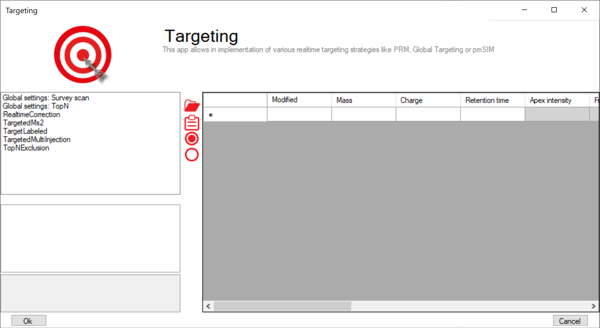

Targeting
=========

    
**MaxQuant.Live enables global targeting of more than 25,000 peptides**
*Christoph Wichmann, Florian Meier, Sebastian Virreira Winter, Andreas-David Brunner, Juergen Cox, Mat-thias Mann*
`doi: 1101/443838 <https://www.biorxiv.org/content/early/2018/10/15/443838>`_

The Targeting app allows the realization of various targeting strategies within on user interface.
First, the list of targeting peptides has to be populated and afterward the targeting strategy has 
to be defined and the parameters have to be set. 

Steps to setup a targeting run
------------------------------

1. Populate the peptide list 
2. Set global parameters
3. Set up targeting action

Peptide ions list
-----------------
The targeting should comprise a set of peptides of interest and a set of high abundant peptides used for the 
real-time corrections of mass-to-charge values, expected retention times and peptide intensities. 

.. In order to get a reliable correction around 100 correction peptides per minute of the gradient is recommended.
.. If the set of targeting peptides is large enough, it is sufficient to only use them as correction peptides.

+--------------------+-------------------------------------------------------------------------------+-----------------------------------------------+
| Column             | Description                                                                   |                                               |
+====================+===============================================================================+===============================================+
| Modified sequence  | String containing the modified sequence                                       | optional; Needed if isotopic labeling is used |
+--------------------+-------------------------------------------------------------------------------+-----------------------------------------------+
| Mass               | Ion mass                                                                      | mandatory                                     |
+--------------------+-------------------------------------------------------------------------------+-----------------------------------------------+
| Charge             | Ion charge state                                                              | mandatory                                     |
+--------------------+-------------------------------------------------------------------------------+-----------------------------------------------+
| Retention time     | Expected retention time (min)                                                 | mandatory                                     |
+--------------------+-------------------------------------------------------------------------------+-----------------------------------------------+
| Apex Intensity     | Expected Apex intensity                                                       | optional                                      |
+--------------------+-------------------------------------------------------------------------------+-----------------------------------------------+
| Fragments mz       | mz values of expected fragment ions                                           | optional; needed for ms2 based corrections    |
+--------------------+-------------------------------------------------------------------------------+-----------------------------------------------+
| MaxIt              | Maximum injection time for triggered scans                                    | optional; if empty the global MaxIt is used   |
+--------------------+-------------------------------------------------------------------------------+-----------------------------------------------+
| NCE factors        | Scaling factors for stepped CE  (white space separated: 1.2 2.3)              | optional;                                     |
+--------------------+-------------------------------------------------------------------------------+-----------------------------------------------+
| Collision Energies | Collision energies for fragmentation (white space separated: 11 21)           | optional; if empty the global NCE is used     |
+--------------------+-------------------------------------------------------------------------------+-----------------------------------------------+
| RealtimeCorrection | Use this ion to calibrate the realtime correction                             |                                               |
+--------------------+-------------------------------------------------------------------------------+-----------------------------------------------+
| TargetedMs2        | Trigger Ms2 scan(s) if ion detected (see TargetedMs2 )                        |                                               |
+--------------------+-------------------------------------------------------------------------------+-----------------------------------------------+
| TargetLabeled      | Use labeled counterpart of this ion as trigger ion  (see TargetLabeled)       |                                               |
+--------------------+-------------------------------------------------------------------------------+-----------------------------------------------+
| TgtMultiInjection  | Trigger multi injection scans for this ion and the labeled counterparts       |                                               |
+--------------------+-------------------------------------------------------------------------------+-----------------------------------------------+
| TopNExclusion      | Exclude this ion from the stochastic Top-N method                             |                                               |
+--------------------+-------------------------------------------------------------------------------+-----------------------------------------------+

Mandatory information
"""""""""""""""""""""

Mandatory columns have a white background and columns containing optional information/settings have a gray background.
The required information of every peptide ion is the mass, the expected retention time and its charge state.

Additionally the modified sequence should be provided to be able to identify the peptide later in the MaxQuant.Live log file.
If the selected targeting strategy comprises the usage of heavy labels, the modified is used by MaxQuant.Live to calculate the
mass differences between the light and heavy channel.

The Apex Intensity is optional. If not set, the ion counts as detected if the number of set isotopic if present in a survey
scan. If set, the ion counts as detected if the ratio of the intensity of the most intense isotopic peak present in the survey scan
and expected Apex intensity is higher than the IntensityPeakRatioThreshold.

The other columns contain checkboxes to enable actions called when the peptide is detected. These actions are also
contained in the left list in the targeting app window.

Automatic population of the targeting table
"""""""""""""""""""""""""""""""""""""""""""

The peptide table can either be filled out manually, or populated automatically by either pasting a table from the clipboard,
or by using tab separated text files.

When pasting from the clipboard, a tabular calculation program like Microsoft Excel can be used to set up the peptide list.
Select the rows of peptides in Excel, copy to the clipboard and click on the paste icon in MaxQuant.Live to paste into the peptide list.
Make sure that the header row is also copied and that it contains the same labels as the MaxQuant.Live peptide list.
A dialog window helps you to map the column headers of the copied content to the MaxQuant.Live table.

The option to populate the table by using tab separated files is the easiest one. First, the evidence files - which is part of the
MaxQuant analysis output - is selected. The column headers mapping is detected automatically, but can be changed by the user.
Please note, that the evidence table should be inspected beforehand and peptides without intensities sorted out.
Of course, the selected file doesn't need to be an evidence file but can be any tab separated text file containing the
required information and the corresponding column headers.

To add the values of the Apex intensity and the fragment ions, which are not present in the evidence table, the
msms table - also part of the MaxQuant analysis output - can be read in to complete the targeting list. As before,
the column mapping can be checked by the user, before the files are parsed by the software and the MaxQuant.Live
targeting list is populated accordingly.

Global settings
---------------

The left list consists of global settings as well as the settings of the various scan actions which can be activated
for every peptide ion in the list by settings the corresponding checkboxes.
Whe a list entry is selected the settings are shown in the box below.

Setup of targeting actions
""""""""""""""""""""""""""

There are three ways to select targeting actions for peptides in the list
1. Click on the checkbox for every peptide manually
2. Select one or more peptides in the list, then select an action from the list of actions in the left panel and click on the check mark symbol in the middle.
3. Add a column with the name of the action to your peptide list in Excel and will it with the Boolean
values ``TRUE`` or ``FALSE``. When pasting the peptide in MaxQuant.Live, the software will set the checkboxes automatically.

Global settings: SurveyScan
"""""""""""""""""""""""""""
The survey scans for the peptide recognition can be either MS1 scan or BoxCar scan. The parameters are described in the BoxCar section.

Global settings: TopN
"""""""""""""""""""""
The TopN strategy is applied on top of the targeting scans. Note, that peptides can also be excluded from being selected
as precursors by using the “ExcludeFromTopN” feature.

RealtimeCorrection 
""""""""""""""""""
The adaptive real-time correction adjusts the expected retention times based on the deviations of the peptide observed before.
We refer to our MaxQuant.Live paper for more information about the real-time correction algorithm.

.. We recommend to select around 100 peptides per minute ensure that the algorithm has enough statistics to
.. take well-founded decisions. These peptide should be have a high intensity.

+--------------------------+--------------------------------------------------------------+---------------+
| Parameter                | Description                                                  | Default value |
+==========================+==============================================================+===============+
| MzTolerances             | Lower and upper bounds for the peptide mz tolerance  [ppm]   | (4.5,10)      |
+--------------------------+--------------------------------------------------------------+---------------+
| RetentionTimeTolerances  | Lower and upper bounds for the retention time tolerance[min] | (1,10)        |
+--------------------------+--------------------------------------------------------------+---------------+
| SigmaScaleFactorRt       | Scaling factor for retention time window adjustment          | 3             |
+--------------------------+--------------------------------------------------------------+---------------+
| PeptideHistoryLength     | Time span considered to calculate the corrections [min]      | 2             |
+--------------------------+--------------------------------------------------------------+---------------+
| MinUsedCorrectionPeptides| Minimum number of peptides used to calculate the corrections | 50            |
+--------------------------+--------------------------------------------------------------+---------------+
| IntPeakRatioThreshold    | The ratio of the current peak intensity to the apex          | 1.00E-05      |
|                          | value has to be higher than this threshold                   |               |
+--------------------------+--------------------------------------------------------------+---------------+
| PepdideDetectionIsoPeaks | Number of isotopic peaks that need to be found               | 2             |
+--------------------------+--------------------------------------------------------------+---------------+
| IsotopeTolerance         | Isotopic peaks distance tolerance [ppm]                      | 9             |
+--------------------------+--------------------------------------------------------------+---------------+
| Ms2DetectionNeeded       | Use only peptide those peptides  for the realtime correction | False         |
|                          | whose fragment ion have been already detected. Make sure     |               |
|                          | that the targetedMs2 is activated and the Fragments mz       |               |
|                          | column populated for these peptide ions.                     |               |
+--------------------------+--------------------------------------------------------------+---------------+
| Ms2ExcludeDetectedPeps   | Disable re-fragmentation of Ms2-detected peptides            | False         |
+--------------------------+--------------------------------------------------------------+---------------+
| Ms2NormIntensity         | Minimal valid intensity normalized to the max. Ms2 peak      | 0.1           |
+--------------------------+--------------------------------------------------------------+---------------+
| Ms2MzTolerance           | Mz tolerance for fragment ion detection in Ms2 scans [ppm]   | 20            |
+--------------------------+--------------------------------------------------------------+---------------+

TargetedMs2
"""""""""""

+-----------------+-----------------------------------------------------------------------------+---------------+
| Parameter       | Description                                                                 | Default value |
+=================+=============================================================================+===============+
| BatMode         | Fragment ion in every cycle within the retention time, even if not detected | FALSE         |
+-----------------+-----------------------------------------------------------------------------+---------------+
| AutoPriority    | Prioritize MS2 scan, if the peptide was not fragmented before               | TRUE          |
+-----------------+-----------------------------------------------------------------------------+---------------+
| MaxNumOfScans   | Upper limit for the number of fragmentations per peptide. 0=no limit        | 0             |
+-----------------+-----------------------------------------------------------------------------+---------------+
| MzOffset        | Shift the isolation window by this mz value [th]                            | 0             |
+-----------------+-----------------------------------------------------------------------------+---------------+
| LowerMzBound    | Lower mz boundary for Ms2 scans                                             | 100           |
+-----------------+-----------------------------------------------------------------------------+---------------+
| CollisionEnergy | Collision energy for fragmentation                                          | 27            |
+-----------------+-----------------------------------------------------------------------------+---------------+
| LifeTime        | Max time span before a scheduled MS2 scan get deleted [ms]                  | 2000          |
+-----------------+-----------------------------------------------------------------------------+---------------+
| MaxIT           | Maximum ion injection time (ms)                                             | 28            |
+-----------------+-----------------------------------------------------------------------------+---------------+
| Resolution      | MS resolving power at m/z 200                                               | 15000         |
+-----------------+-----------------------------------------------------------------------------+---------------+
| AgcTarget       | AGC target value (charges)                                                  | 100000        |
+-----------------+-----------------------------------------------------------------------------+---------------+
| PositiveMode    | Ion polarity                                                                | TRUE          |
+-----------------+-----------------------------------------------------------------------------+---------------+

TargetLabeled
"""""""""""""
This action adds the SILAC label masses to the peptides masses in the list. The “Modified is used to calculate the number Arg and Lys amino acids. The masses of SILAC labels can be freely defined here.

TargetedMultiInjection
""""""""""""""""""""""

With this action, scans are triggered in which the heavy and the light channel are both selected by the quadrupole and
analyzed together. If fragmentation is switched on, this resembles a PRM experiment. If fragmentation is turned off,
it corresponds to an SIM experiment.
The pmSIM acquisition strategy described in the paper can be implemented with this action turning on the BatMode switch.

+-------------------+----------------------------------------------------------------------------------------------+---------------+
| Parameter         | Description                                                                                  | Default value |
+===================+==============================================================================================+===============+
| WindowSize        | Size of the isolation windows [th]                                                           | 1.4           |
+-------------------+----------------------------------------------------------------------------------------------+---------------+
| WindowOffset      | Shift the isolation window centers by this offset [th]                                       | 0             |
+-------------------+----------------------------------------------------------------------------------------------+---------------+
| BatMode           | Fragment ion in every cycle within the retention time tolerance window, even if not detected | FALSE         |
+-------------------+----------------------------------------------------------------------------------------------+---------------+
| NceLight / Heavy  | Normalized collision energy for the light/heavy channel                                      |  0            |
+-------------------+----------------------------------------------------------------------------------------------+---------------+
| ItBoxSize         | Maximum injection time per light or heavy mass range. If smaller than MaxIt, the MaxIt is    |  100          |
|                   | spread over multiple injections, each fulfilling the max. injection time per box condition.  |               |
+-------------------+----------------------------------------------------------------------------------------------+---------------+
| Isotopic label    | Masses of SILAC labels                                                                       |               |
+-------------------+----------------------------------------------------------------------------------------------+---------------+
| PositiveMode      | Ion polarity                                                                                 | TRUE          |
+-------------------+----------------------------------------------------------------------------------------------+---------------+
| CollisionEnergy   | Collision energy for fragmentation                                                           | 0             |
+-------------------+----------------------------------------------------------------------------------------------+---------------+
| LowerMzBound      | Lower mz boundary for Ms2 scans                                                              | 100           |
+-------------------+----------------------------------------------------------------------------------------------+---------------+
| LifeTime          | Max time span before a scheduled MS2 scan get deleted [ms]                                   | 1000          |
+-------------------+----------------------------------------------------------------------------------------------+---------------+
| Resolution        | MS resolving power at m/z 200                                                                | 30000         |
+-------------------+----------------------------------------------------------------------------------------------+---------------+
| AutoPriority      | Prioritize MS2 scan, if the peptide was not fragmented before                                | TRUE          |
+-------------------+----------------------------------------------------------------------------------------------+---------------+
| MaxNumOfScans     | Upper limit for the number of fragmentations per peptide. 0=no limit                         | 0             |
+-------------------+----------------------------------------------------------------------------------------------+---------------+
| MaxIT             | Maximum ion injection time (ms) [not used]                                                   | 50            |
+-------------------+----------------------------------------------------------------------------------------------+---------------+
| MaxItLight /Heavy | Maximum ion injection time for light/heavy channel (ms)                                      | 100           |
+-------------------+----------------------------------------------------------------------------------------------+---------------+
| AgcTarget         | AGC target value (charges)                                                                   | 100000        |
+-------------------+----------------------------------------------------------------------------------------------+---------------+
| InjectTargetL/H   | AGC target value for light/heavy peptide (charges)                                           | 50000         |
+-------------------+----------------------------------------------------------------------------------------------+---------------+

ExcludeFromTopN
"""""""""""""""

+-----------------------+-----------------------------------------------------------------------------------------+---------------+
| Parameter             | Description                                                                             | Default value |
+=======================+=========================================================================================+===============+
| BatMode               | Exclude ion from TopN within the retention time tolerance window , even if not detected | FALSE         |
+-----------------------+-----------------------------------------------------------------------------------------+---------------+
| StaticExclusionTime   | Time span the peptide is excluded from TopN (30)                                        | 30            |
+-----------------------+-----------------------------------------------------------------------------------------+---------------+
| AdaptiveExclusionTime | Automatic exclusion of the peptide from TopN                                            | TRUE          |
+-----------------------+-----------------------------------------------------------------------------------------+---------------+

