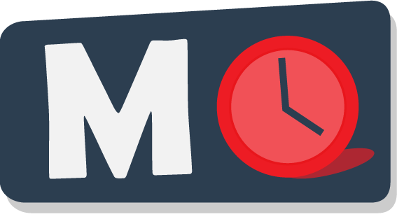

MaxQuant.Live: Documentation
=======================================

   
`MaxQuant.Live`_ is a software framework for real-time monitoring of mass spectrometric data and controlling of the data acquisition.

Installation and Versions 
    Whenever you push code to your favorite version control system,
    whether that is Git, Mercurial, Bazaar, or Subversion,
    Read the Docs will automatically build your docs
    so your code and documentation are always up-to-date.

Software framework
    Read the Docs can host and build multiple versions of your docs
    so having a 1.0 version of your docs and a 2.0 version
    of your docs is as easy as having a separate branch or tag in your version control system.

Data acquisition Apps
    Read the Docs is free and open source and hosts documentation
    for nearly 100,000 large and small open source projects
    in almost every human and computer language.

.. _MaxQuant.Live: http://maxquant.live

First steps
-----------

.. toctree::
   :maxdepth: 2
   :caption: User interface  
   
   mainWindow   

.. toctree::
   :maxdepth: 2
   :glob:
   :caption: Usage

   installation
   manageScanProtocol
   runScanProtocol

.. toctree::
   :maxdepth: 2
   :glob:
   :caption: Apps
   
   appBoxCar

