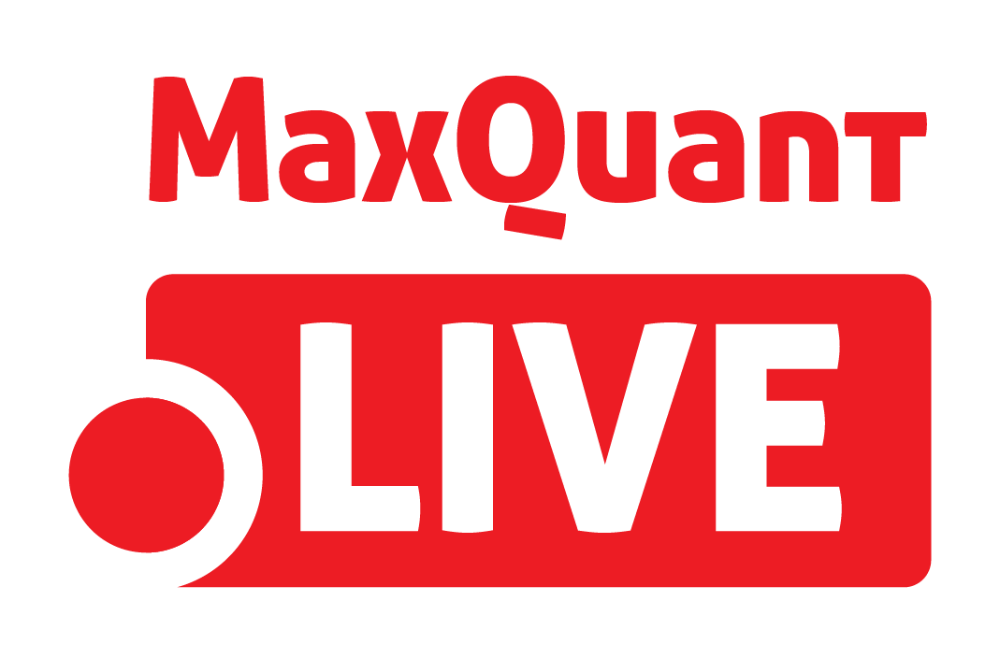

MaxQuant.Live: Documentation
=======================================

   
This is the user documentation of MaxQuant.Live, a software framework for real-time monitoring of mass spectrometric data and controlling of the data acquisition. MaxQuant.Live can be downloaded on `http://maxquant.live <http://maxquant.live>`_ 

Publication:
   **MaxQuant.Live enables global targeting of more than 25,000 peptides**
   *Christoph Wichmann, Florian Meier, Sebastian Virreira Winter, Andreas-David Brunner, Juergen Cox, Matthias Mann*
   `doi: 1101/443838 <https://www.biorxiv.org/content/early/2018/10/15/443838>`_

.. note:: This user documentation is not fully complete yet and is frequently updated. 

.. toctree::
   :maxdepth: 2
   :caption: Overview  
   
   mainWindow   
   operationModes   

.. toctree::
   :maxdepth: 2
   :glob:
   :caption: Usage

   installation
   manageScanProtocol
   runScanProtocol

.. toctree::
   :maxdepth: 2
   :glob:
   :caption: Apps
   
   appBoxCar
   appEasiTag
   appTargeting

   
