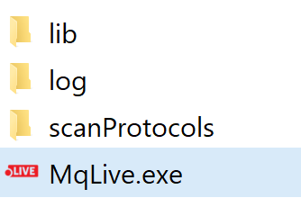

Installation 
============

Check requirements
------------------
* Microsoft .NET Framework 4.7.2 
* Q-Exactive Tune 2.9 or higher
* No IAPI licence is required 
* Thermo Fisher Q-Exactive Mass Spectrometer HF/HF-X

.. note:: Q Exactive classic/plus instruments were not tested and are not officially supported. 

Download and unpack 
-------------------
The latest version 1.2 can be downloaded from http://maxquant.live and is valid until 6/1/2020.
Unpack the zip file in a new folder on the local hard drive of the acquisition computer.

    
If necessary, create empty ‘log’ and ‘scanProtocols’ folders manually. To set up MaxQuant.Live, continue reading 
`here <mainWindow>`_.

