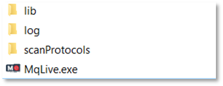

Installation 
============

Check requirements
------------------
* Microsoft .NET Framework 4.6.2 
* Q-Exactive Tune 2.9 
* No IAPI licence is required 
* Thermo Fisher Q-Exactive Mass Spectrometer HF/HF-X
.. note:: Q Exactive classic/plus instruments were not tested and are not officially supported. 

Download and unpack 
-------------------
The latest version 0.99 can be downloaded from http://maxquant.live and is valid until 1/1/2019.
Unpack the zip file in a new folder on the local hard drive of the acquisition computer.

    
If necessary, create empty ‘log’ and ‘scanProtocols’ folders manually. To set up MaxQuant.Live, continue reading 
`here <mainWindow>`_.

Publications 
-------------
**MaxQuant.Live enables global targeting of more than 25,000 peptides**
*Christoph Wichmann, Florian Meier, Sebastian Virreira Winter, Andreas-David Brunner, Juergen Cox, Mat-thias Mann*
`doi: 1101/443838 <https://www.biorxiv.org/content/early/2018/10/15/443838>`_

**BoxCar acquisition method enables single-shot proteomics at a depth of 10,000 proteins in 100 minutes**
*Florian Meier, Philipp E. Geyer, Sebastian Virreira Winter, Juergen Cox & Matthias Mann*
`doi: 10.1038/s41592-018-0003-5 <https://www.nature.com/articles/s41592-018-0003-5>`_

**EASI-tag enables accurate multiplexed and interference-free MS2-based proteome quantification**
*Sebastian Virreira Winter, Florian Meier, Christoph Wichmann, Juergen Cox, Matthias Mann & Felix Meiss-ner*
`doi: 10.1101/225649 <https://www.nature.com/articles/s41592-018-0037-8>`_

