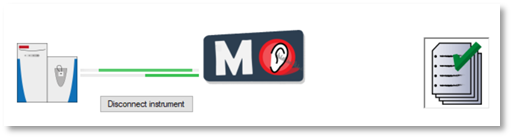
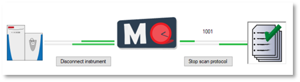

Main window of MaxQuant.Live 
============================
The main window of MaxQuant.Live consists of three sections, which you can open by clicking on the symbols in the main menu.

Modules 
-------

Instrument 
^^^^^^^^^

.. figure:: figures/image008.jpg
    :align: left
The instrument type can be selected here connected using the “connect instrument” button. 
In this ver-sion, only Thermo Fisher Scientific Q Exactive HF-X mass spectrometers are supported (Tune Version 2.9).

Main Module
^^^^^^^^^^^
.. figure:: figures/image010.jpg
    :align: left
This part of the software is the link between the instrument and the scan protocol Library. 
It consists of a log message window and the configuration of the log directory. 
It is recommended to always load the log directory before connecting the instrument.
The files written to this directory contain all log messages that were also shown in the graphical user interface. There are two types of log file written out by MaxQuant.Live 
Global log file: MaxQuant.Live will create global log files on every day. 
The filename is the date itself. These files contain all the log messages that were thrown when no scan protocol was running. 
Specific log files: During the execution of a scan protocol, the log messages are written to scan proto-col specific log file. The file name starts with the four-digit identification number, followed by the date and the time of execution. When the scan protocol ended, the log messages are again written into the global log file. 

Scan Protocol Library  
^^^^^^^^^^^^^^^^^^^^^

.. figure:: figures/image011.png
    :align: right    
Scan protocols implement various the acquisition strategies supported by our software. Every scan proto-col has a certain type (BoxCar, EasiTag…), a unique four-digit identification number and a short experiment description. All scan protocols are stored in a library. 
In the scan protocol section of the software you can manage the library. 

New scan protocol:
""""""""""""""""""

When you click on the “New” button, the app store opens. First, select the acqui-sition method that should be used in the new scan protocol. Click on the big symbol to open the settings for the selected app (see Sec.7). A green checkmark indicates which app has been selected. Next, select a unique identification number for your scan protocol. The list in the drop-down menu excludes id numbers that are already present in the library. Finally fill in a short description of the experiment and click create. The scan protocol will be saved as file in the scan protocol folder and appear in the scan protocol library. 

Edit scan protocols: 
""""""""""""""""""""
.. figure:: figures/image017.png
    :align: right
Scan protocols in the library can be edited later by clicking the “Edit” button. It is possible to change the global properties like the ID number and the short description of the scan protocol. Furthermore, it is possible to edit the specific parameters of an acquisition strategy using the respective app. 

Copy and Delete: 
""""""""""""""""
Existing scan protocols can be easily copied by clicking the “Copy” button. The copy gets automatically an ID number assigned, is added to the library and can be edited afterwards by the user. Existing Scan Protocols can also be deleted by the user by clicking the “Delete” button.

Storage and Compatibility: 
"""""""""""""""""""""""""
Scan protocols are saved as files (“.mqlive”) local library, which serves as scan protocol library. The path has to be set at when the software is started but can be changed after-wards during runtime. Therefore is it possible to use several scan protocol libraries for different experi-ments or users. Please note that every scan protocol has a version number, which is the version of the MaxQuant.Live that has been used to create or edit it the last time. Compatibility is not guaranteed if the scan protocol the MaxQuant.Live version differ. In this case, edit the settings to check the parameters and save the scan protocol to update the version number. 

Run scan protocol:
""""""""""""""""""
See Sec. 6
 
Operating modes of MaxQuant.Live
-------
The logo in the middle of the symbol bar of MaxQuant.Live displays the current operation mode of the software. 
There are three operation modes:

Setup Mode 
^^^^^^^^^^
.. figure:: figures/image019.png
    :width: 250px
    :align: right
This is the initial operation mode after software startup. In this modus, three parts of MaxQuant.Live (Sec. 4) can be configured. 
After loading the log-directory, the scan protocol library and connecting the instru-ment,
MaxQuant.Live switches to the Listening Mode.

Listening Mode 
^^^^^^^^^^^^^^

In this mode, the software receives all the spectra acquired by the instrument but does not send any commands 
to the mass spectrometer. MaxQuant.Live is therefore not affecting the data acquisition of the mass spectrometer. 
Scan protocols can be started in the software is in this operation mode. After the startup of a scan protocol,
MaxQuant.Live switches to the Running Mode. 

Running Mode
^^^^^^^^^^^^

This operation mode is active during the execution of a scan protocol.
Afterwards, the software automati-cally switches back to the listening mode. 
