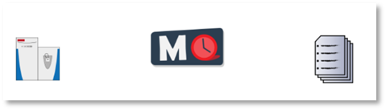
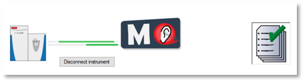
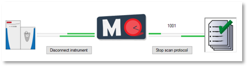

Operating modes of MaxQuant.Live
================================

The logo in the middle of the symbol bar of MaxQuant.Live displays the current operation mode of the software. 
There are three operation modes:

Setup Mode 
----------

This is the initial operation mode after software startup. In this modus, three parts of MaxQuant.Live (Sec. 4) can be configured. 
After loading the log-directory, the scan protocol library and connecting the instru-ment,
MaxQuant.Live switches to the Listening Mode.

Listening Mode 
--------------

In this mode, the software receives all the spectra acquired by the instrument but does not send any commands 
to the mass spectrometer. MaxQuant.Live is therefore not affecting the data acquisition of the mass spectrometer. 
Scan protocols can be started in the software is in this operation mode. After the startup of a scan protocol,
MaxQuant.Live switches to the Running Mode. 

Running Mode
------------

This operation mode is active during the execution of a scan protocol.
Afterwards, the software automati-cally switches back to the listening mode. 
