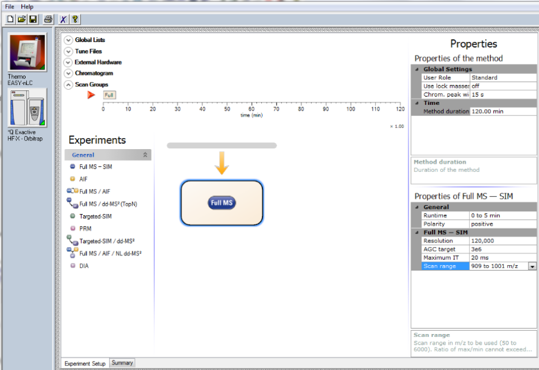
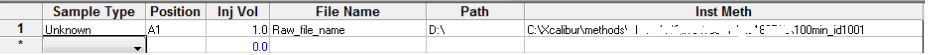

Running Scan protocols
======================

Once MaxQuant.Live is in the Listening Mode (Sec. 5.2) scan protocols can be started either 
manually or in an automated manner.

Manual startup
--------------
To be able to start a scan protocol manually, the instrument has to be in Running Mode. 
Therefore, is has to run idle or an Xcalibur method. Check, by using the control software Tune, if 
the instrument is constantly performing scans. Only in this instrument modus can MaxQuant.Live start scan protocols. 
To start up a scan protocol, navigate to the library, select the desired scan protocol and click the “run” button.
MaxQuant.Live switches into the `Running Mode <mainWindow>`_.
While a scan protocol is running, you can see its Id number in the symbol bar right of the GUI.  MaxQuant.Live is now directing the data acquisition according to the logic implemented in the scan protocol. 
If you switch to Tune, then you should see incoming log messages indicating that MaxQuant.Live took over the control of the mass spectrometer. Switching back to MaxQuant.Live, the execution of the scan protocol can be terminated by clicking the “Stop scan protocol” button. MaxQuant.Live then switches back into `Listening Mode <mainWindow>`_.

Automated startup 
-----------------
The startup of a scan protocol can be triggered by an incoming so-called “magic scan”. If MaxQuant.Live is in listening mode and receives Ms1 scans with the scan range m/z 909 to XXXX, then the scan protocol with Id number XXXX is loaded from the library and started immediately. This feature enables a seamless integration of MaxQuant.Live into the standard LC-MS controlled by Xcalibur, because the magic scans can be easily defined as Xcalibur method (see below). Doing this, MaxQuant.Live takes over the control directly after a ‘magic’ Xcalibur method starts. 

Xcalibur method setup
^^^^^^^^^^^^^^^^^^^^^

    
1. Create a new Xcalibur method via the standard method editor. Enter LC settings, Tune files, etc. as you would normally do. Please refer to the Xcalibur user manual for help. Caution: Make sure that the MS method duration is equal to your LC run time.
2. In the MS method, create one Full MS – SIM scan with the scan range m/z 909 to MaxQuant.Live Id, for example m/z 909 to 1001 for the MaxQuant.Live scan protocol with the unique identifier 1001 created above. Set the scan runtime to an arbitrary value >1 min, but less than the method duration. The scan resolution should be equal to the Full Scan resolution set in the MaxQuant.Live scan protocol. 
3. Add a second Full MS – SIM scan as in Step 2,  but now set the scan range from m/z 908 to “1000 + LC run time”, for example m/z 908 to 1100 for a 100 min LC-MS experiment. This step is not required but recommended.
4. Review all settings and save the method.

Data acquisition
^^^^^^^^^^^^^^^^

1. Make sure that MaxQuant.Live is in Listening mode (Sec. 5.2). 
2. Check if your scan protocol library is loaded and the scan protocol with ID number defined before (1001) is present in the list. The setting “Start scan protocol by magic scan” has to be true (default). 
3. Open the Xcalibur software and set up a new acquisition sequence. Select the Xcalibur method generated above as the instrument method for your BoxCar runs. Note that different MaxQuant.Live protocols require different Xcalibur methods.
4. Start the acquisition sequence. MaxQuant.Live will take over control as soon as the trigger signal (full MS scan with a scan range starting at m/z 909, ‘magic scan’) is identified. The home view will indicate that the software is now in Running Mode (Sec. 5.3). Acquisition will stop automatically at the end of the LC-MS run and the Xcalibur sequence will continue with the next run (if applicable). Stop scan protocol stops any running protocol immediately. 

    
5. Disconnect the instrument and close MaxQuant.Live once all experiments are finished.

